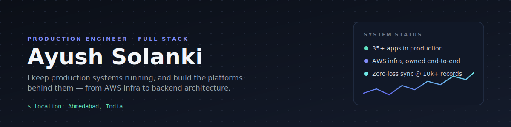
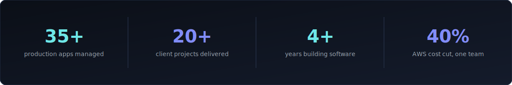

 

## About Me

I build backend systems and infrastructure for products businesses actually run on, not just features that ship and get forgotten.

Currently a **Production Engineer & Full Stack Engineer** at **Gohil Infotech**, where I own AWS infrastructure and backend for 35+ live applications. Before that, I spent years as a freelance full stack developer, delivering 20+ projects end to end, from the first client call to the server that stays up at 2 AM.

I care more about *why* something is built a certain way than about following a tutorial. Most of what I know came from fixing things in production at 2 AM, not from a course.

 

## What I'm Building

**[Soseki](https://github.com/ayushsolanki29/soseki-app)** is an open source business operating system for freelancers, consultants, and small agencies.

The idea is simple. Instead of juggling five different tools for clients, projects, invoices, expenses, and support tickets, you get everything in one self hosted platform. It handles multi currency invoicing and includes AI assisted tools to import existing data from QuickBooks, CSV files, or spreadsheets, making migration much easier.

Built with Next.js, Node.js, PostgreSQL, and Prisma, Soseki is designed to let users own their data without vendor lock in.

Early on I over engineered it with queues, background workers, and event systems before shipping a usable version. That experience taught me a lesson I still follow today. Ship a useful product first, then scale the parts that genuinely need it.

 

## A Problem I'm Proud Of

**Biometric Attendance Synchronization**

Biometric devices were producing thousands of attendance records every day, while unstable network connections caused duplicate records, failed synchronization, and missing attendance data.

I designed a queue based synchronization architecture using Node.js, Redis, and BullMQ with chunk processing, idempotent operations, and automatic retries.

The result was reliable synchronization of more than **10,000 attendance records** with **zero data loss**.

 

## Tech Stack

**Currently exploring:** Event driven architecture • Distributed systems • Platform engineering • AI integrated tooling

 

## By the Numbers

 

 

## Connect

 

Ahmedabad, India • Always open to discussing backend engineering, cloud infrastructure, production systems, and Soseki.

